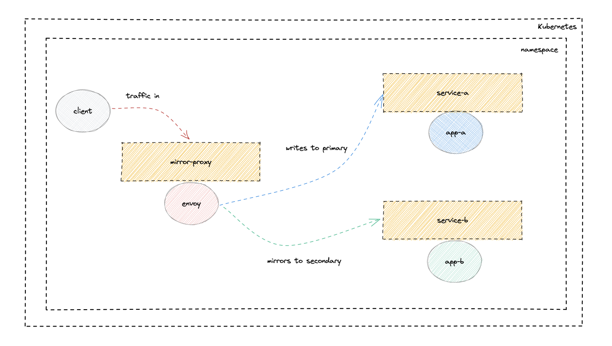

# kube-mirror

Generate Kubernetes manifests via [jsonnet](https://jsonnet.org/)
to deploy an Envoy based proxy that can be 
used to mirror traffic to a secondary service.

This technique, commonly known as traffic shadowing, can be
used to test new versions of a service or for comparative benchmarking.

Mirrored requests are made in a fire-and-forget fashion with
the response being discarded.

